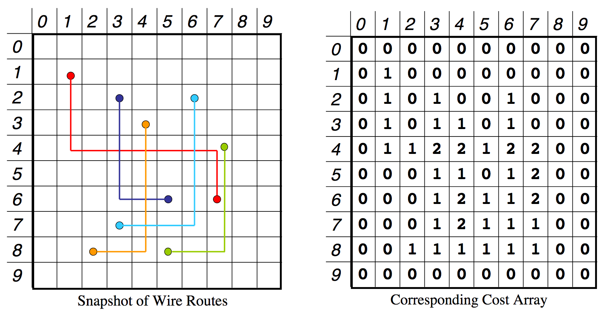

# Parallel Computer Architecture & Programming (15-418/618)
# Assignment 3: Parallel VLSI Wire Routing via OpenMP
##### Carnegie Mellon University; Todd Mowry and Brian Railing

### Authors: Jack Kasbeer, Qifang (Charlie) Cai
### Created: October, 2016
### [Modified: July 12, 2018 19:02 CDT]

## Overview
Given input files specifying the dimensions of a 2D grid, along with the end points for a collection of wires, 
we used OpenMP to parallelize our Manhattan-style routes algorithm to produce the optimal` pathes each wire should take on the (given) 2D grid.

`: In this exercise, an "optimal" solution is one where the fewest possible wire intersections occur for the given wires & grid.

## Resources
* Carnegie Mellon Staff & Students
* 59 cores of an Intel Xeon Phi processor

## Programming Task: Parallel VLSI Wire Routing
Input files given in the following format:

X_dimension Y_dimension # dimensions of the 2D grid
number_of_wires         # total number of wires, each of which is described below
X1 Y1 X2 Y2             # coordinates of the endpoints for wire 0
X1 Y1 X2 Y2             # coordinates of the endpoints for wire 1
X1 Y1 X2 Y2             # coordinates of the endpoints for wire 2
...
X1 Y1 X2 Y2             # coordinates of the endpoints for wire (number_of_wires - 1)

Figure 1 (above): Format of the input file that describes a particular problem

## Further Algorithmic Details
Priorities in choosing a route: (1) Select one that minimizes the maximum 'cost array' value along the route 
(the 'cost array' stores the number of wires that pass through a given point (x,y) on the grid). Next, given a set of equivalent
maximum 'cost array' values, (2) Miniimize the sum of the 'cost array' values along the entire path.  After this, (3) Ties can be broken arbitrarily.

Here's an example of what a potential snapshot of wire routes grid and its corresponding cost array may look like:

Format: 

## Algorithmic Approach: Simplified Simulated Annealing
1. With probability 1 - P, choose the current min path.  Otherwise, choose a
a path uniformly at random from the space of delt_x + delt_y possible routes.
1. Calculate cost of current path, if not known. This is the current min path.
1. Consider all paths which first travel horizontally.
If any costs less than the current min path, that is the new min path.
1. Same as (2), using vertical paths.

Idea for later ?? Split up work of updating cost array by cells versus by wires
                  Structure to store "no touch points" (i.e. pt's with higher costs)??
                  Sort path points before updating cost array --> LOCALITY
		  

## Directory structure
├── code

│   ├── inputs

│   │   ├── problemsize --> Input for the question to explore the effect of problem size
	    
│   │   ├── testinput

│   │   └── timeinput

│   ├── jobs

│   │   ├── batch_generate.sh --> Generate jobs in batch, specify the arguments for the program here
	    
│   │   ├── example.job.template --> The template for generating the jobs
	    
│   │   └── generate_jobs.sh --> The script for the jobs
	    
│   ├── latedays

│   │   └── submit.sh --> The script to submit all the jobs in jobs folder to latedays.
	    
│   ├── Makefile

│   ├── mic.h --> Macros for offload the program to Xeon Phi
	    
│   ├── validate.py --> Scripts to validate the consistency of output wire routes and cost array
			Run "python validate.py -h" to see the instructions to use the script
	
│   ├── WireGrapher.java --> Graph the input wires, see handout for instructions
	
│   ├── wireroute.cpp --> The code for reading and parsing command line argument and a offload pragma example
	
│   ├── wireroute.h

├── examples --> Examples for OpenMP
    
│   ├── hello.c

│   ├── loop.c

│   ├── Makefile

│   ├── README

│   └── sqrt.c

├── README --> This file
    
└── tutorials

    └── openmp.pdf --> OpenMP tutorial

# Progress Notes & Course Info. Provided
## Get started
#### Dev Notes from start of project
0. Read handout
1. Read README
2. Read wireroute.cpp and wireroute.h including comments
3. Define wire_t and any additional data structures you need
4. Offload additional data to(if any) Xeon Phi using similar pragma
5. Implement the serial version of the algorithm and test locally using ``make cpu'', you can use validate.py to validate the result
6. Parallelize the algorithm and test locally
7. Submit to latedays queue for performance testing
8. Answer questions on the handout

### When to submit to latedays
We suggest you to develop and debug your program without submitting jobs to the job queue in latedays. ``make cpu'' will generate the code runnable on machines that has OpenMP installed. If you log into latedays.andrew.cmu.edu, you'll be able to run the program compiled from ``make cpu''.

### How to generate and submit jobs to latedays?
0. Change the APP_NAME in jobs/example.job.template to the name of your binary wire routing program
1. Change the inputdir in jobs/example.job.template to the directory of input file.
2. Change the $threads and $inputs in jobs/batch_generate.sh to the values you want, these are thread and input arguments feed to your wire routing program.
3. Run ``make submit'', you'll be able to see the result of the program in ``latedays'' folder.

